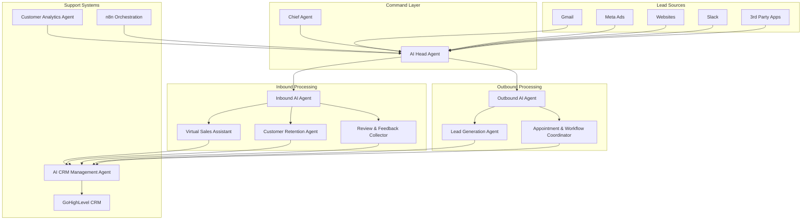

# Design Document

## Overview

This design document outlines the architecture for an autonomous AI team system that functions as a complete sales, customer service, and marketing organization for a real estate business. The system employs a hierarchical multi-agent architecture with specialized AI agents that collaborate to manage the entire customer journey while continuously optimizing performance through machine learning feedback loops.

The system is designed around the concept of an "AI organization" with clear command structure, specialized roles, and autonomous decision-making capabilities that mirror human business operations but operate at machine speed and scale.

## Architecture

### High-Level Architecture



### Technology Stack

- **Orchestration Platform**: n8n for workflow automation and agent coordination
- **CRM Integration**: GoHighLevel (GHL) for lead management and data persistence
- **AI/LLM Platform**: OpenAI GPT-4 or Claude for conversational AI agents
- **Voice AI**: ElevenLabs or similar for voice calling capabilities
- **Communication Channels**: Twilio for SMS, SendGrid for email, WhatsApp Business API
- **Analytics Platform**: Custom analytics engine with real-time dashboards
- **Database**: PostgreSQL for system data, Redis for caching and session management

## Components and Interfaces

### 1. Command Structure Components

#### Chief Agent

- **Purpose**: Highest-level system overseer and human interface
- **Responsibilities**:
  - Monitor all subordinate agent performance
  - Serve as primary human contact point
  - Execute strategic directives and system overrides
  - Generate executive-level reports and insights
- **Interfaces**:
  - Human dashboard for status monitoring and control
  - Direct communication with AI Head Agent
  - System-wide alert and notification management

#### AI Head Agent

- **Purpose**: Operational manager and central dispatcher
- **Responsibilities**:
  - Analyze and route incoming leads
  - Process performance feedback for system optimization
  - Coordinate between inbound and outbound workflows
  - Implement dynamic routing rule adjustments
- **Interfaces**:
  - Lead ingestion API from all sources
  - Performance data feed from Analytics Agent
  - Command interface to specialized agents
  - Reporting interface to Chief Agent

### 2. Lead Ingestion and Routing Engine

#### Multi-Source Lead Collector

- **Purpose**: Unified lead capture from all channels
- **Implementation**:
  - Gmail API integration for email leads
  - Meta Business API for social media leads
  - Webhook endpoints for website form submissions
  - Slack API for internal referrals
  - Generic API endpoints for 3rd-party integrations
- **Data Processing**:
  - Lead normalization and standardization
  - Duplicate detection and merging
  - Source attribution and quality scoring

#### Intelligent Routing System

- **Purpose**: Analyze leads and determine optimal processing path
- **Analysis Criteria**:
  - Lead type classification (hot, warm, cold)
  - Source quality scoring
  - Urgency level assessment
  - Intent signal detection
- **Routing Logic**:
  - Rule-based initial routing
  - Machine learning-enhanced decision making
  - Dynamic adjustment based on performance feedback

### 3. Inbound AI Agent Workflows

#### Virtual Sales Assistant (Voice Agent)

- **Purpose**: Immediate response to hot leads with voice qualification
- **Technical Implementation**:
  - Real-time voice AI using ElevenLabs or similar
  - Speech-to-text and text-to-speech processing
  - Dynamic script generation based on lead context
  - Seamless human transfer capabilities
- **Qualification Process**:
  - Budget assessment questions
  - Location and property type preferences
  - Timeline and urgency evaluation
  - Appointment booking integration
- **Integration Points**:
  - Calendar systems for appointment scheduling
  - CRM for real-time lead status updates
  - Human agent queue for complex transfers

#### Customer Retention & Re-engagement Agent

- **Purpose**: Automated re-engagement of inactive customers
- **Trigger Mechanisms**:
  - CRM-based inactivity detection (60+ days)
  - Behavioral pattern analysis
  - Lifecycle stage transitions
- **Engagement Strategies**:
  - Personalized message generation based on history
  - Multi-channel outreach (SMS, email, WhatsApp)
  - Dynamic offer creation and presentation
- **Response Handling**:
  - Interest level assessment
  - Workflow routing based on engagement
  - Status updates and follow-up scheduling

#### Review & Feedback Collector Agent

- **Purpose**: Post-sale feedback collection and reputation management
- **Activation Triggers**:
  - Project completion status in CRM
  - Milestone-based feedback requests
  - Scheduled follow-up sequences
- **Feedback Processing**:
  - Sentiment analysis of responses
  - Issue escalation for negative feedback
  - Review platform guidance for positive feedback
- **Integration Features**:
  - Google Reviews API integration
  - Social media platform connections
  - Internal feedback database management

### 4. Outbound AI Agent Workflows

#### AI Lead Generation Agent

- **Purpose**: Proactive outreach to cold and warm leads
- **Lead Processing Types**:
  - Cold lead follow-up sequences
  - Campaign-driven outreach
  - Warm lead re-engagement
- **Message Personalization**:
  - Historical interaction analysis
  - Behavioral pattern recognition
  - Dynamic content generation
- **Performance Optimization**:
  - A/B testing of message variants
  - Timing optimization based on response rates
  - Channel effectiveness analysis

#### AI Appointment & Workflow Coordinator

- **Purpose**: Manage complex outbound sequences and appointment booking
- **Workflow Management**:
  - Multi-step campaign orchestration
  - Callback scheduling and management
  - Reminder sequence automation
- **Appointment Features**:
  - Calendar integration and availability checking
  - Automated confirmation and reminder sending
  - Rescheduling and cancellation handling
- **Campaign Coordination**:
  - Audience segmentation for campaigns
  - Performance tracking and optimization
  - Cross-channel campaign management

### 5. Support System Components

#### AI CRM Management Agent

- **Purpose**: Comprehensive CRM data management and synchronization
- **Data Management**:
  - Real-time interaction logging
  - Lead status updates and pipeline management
  - Contact information synchronization
- **GoHighLevel Integration**:
  - API-based data synchronization
  - Workflow trigger management
  - Custom field updates and management
- **Data Quality**:
  - Duplicate detection and resolution
  - Data validation and cleansing
  - Audit trail maintenance

#### AI Customer Analytics Agent

- **Purpose**: Performance monitoring and optimization insights
- **Metrics Tracking**:
  - Conversion rate analysis
  - Agent performance scoring
  - Lead source effectiveness
  - Campaign ROI measurement
- **Optimization Intelligence**:
  - Script performance analysis
  - Timing optimization recommendations
  - Channel effectiveness insights
- **Reporting Features**:
  - Real-time dashboard updates
  - Automated insight generation
  - Performance trend analysis

## Data Models

### Lead Data Model

```typescript
interface Lead {
  id: string;
  source: LeadSource;
  contactInfo: ContactInfo;
  leadType: "hot" | "warm" | "cold";
  urgencyLevel: number;
  intentSignals: string[];
  qualificationData: QualificationData;
  interactionHistory: Interaction[];
  status: LeadStatus;
  assignedAgent: string;
  createdAt: Date;
  updatedAt: Date;
}

interface ContactInfo {
  name: string;
  email?: string;
  phone?: string;
  preferredChannel: "email" | "sms" | "voice" | "whatsapp";
  timezone: string;
}

interface QualificationData {
  budget?: BudgetRange;
  location?: string;
  propertyType?: string;
  timeline?: string;
  qualificationScore: number;
}
```

### Interaction Data Model

```typescript
interface Interaction {
  id: string;
  leadId: string;
  agentId: string;
  type: "call" | "sms" | "email" | "whatsapp";
  direction: "inbound" | "outbound";
  content: string;
  outcome: InteractionOutcome;
  duration?: number;
  sentiment?: SentimentScore;
  nextAction?: ScheduledAction;
  timestamp: Date;
}

interface InteractionOutcome {
  status: "successful" | "failed" | "transferred";
  appointmentBooked?: boolean;
  qualificationUpdated?: boolean;
  escalationRequired?: boolean;
}
```

### Agent Performance Data Model

```typescript
interface AgentPerformance {
  agentId: string;
  period: DateRange;
  metrics: {
    totalInteractions: number;
    conversionRate: number;
    averageResponseTime: number;
    appointmentBookingRate: number;
    customerSatisfactionScore: number;
  };
  scriptPerformance: ScriptMetrics[];
  optimizationSuggestions: string[];
}
```

## Error Handling

### Error Classification

- **Critical Errors**: System failures that require immediate human intervention
- **Operational Errors**: Agent failures that can be automatically recovered
- **Data Errors**: Inconsistencies that require validation and correction
- **Integration Errors**: External service failures requiring retry logic

### Error Recovery Strategies

- **Automatic Retry**: Exponential backoff for transient failures
- **Graceful Degradation**: Fallback to simpler workflows when complex ones fail
- **Human Escalation**: Automatic handoff for unresolvable issues
- **Data Recovery**: Backup and restore mechanisms for data integrity

### Monitoring and Alerting

- **Real-time Error Tracking**: Immediate notification of critical failures
- **Performance Monitoring**: Continuous tracking of system health metrics
- **Predictive Alerting**: Early warning systems for potential issues
- **Audit Logging**: Comprehensive logging for troubleshooting and compliance

## Testing Strategy

### Unit Testing

- Individual agent logic testing
- Data model validation testing
- API integration testing
- Error handling scenario testing

### Integration Testing

- End-to-end workflow testing
- CRM synchronization testing
- Multi-agent coordination testing
- External service integration testing

### Performance Testing

- Load testing for high-volume lead processing
- Response time testing for 60-second SLA
- Scalability testing for agent coordination
- Stress testing for system reliability

### User Acceptance Testing

- Lead processing workflow validation
- Agent performance quality assessment
- Human handoff process testing
- Dashboard and reporting functionality testing

### Continuous Testing

- Automated regression testing
- Performance monitoring in production
- A/B testing for optimization features
- Real-world scenario simulation testing
